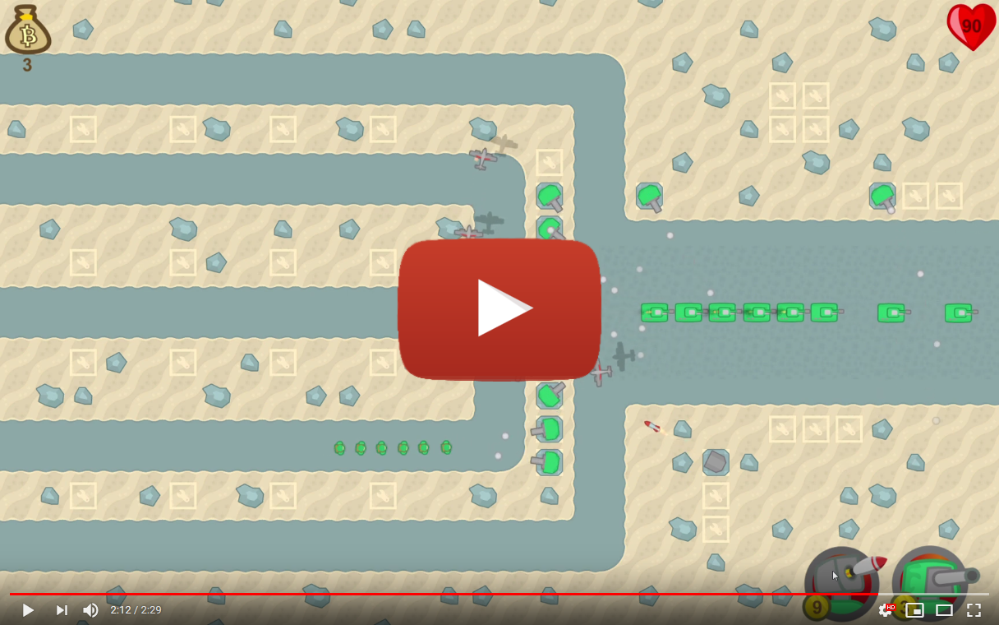

Tower Defence
=========

Tower defence made in Unity 3D game engine. Created during the [Game Development Middleware course](https://gamedev.cuni.cz/study/fields/game-programming-mff-cuni-cz/) at the MFF at Charles University. Contains basics of the Unity including particle systems, object pooling, basic sound usage, simple UI and multiple scenes and levels.
## Code & running

A Windows build can be found [here](https://drive.google.com/open?id=18KlztVYkHWL28IpqXQfilkcBg4smVlU1) and an Android build [here](https://drive.google.com/open?id=1KJDYkGsdJYC8GHrgMhJVwAoouhi9fgY-). Note that the game should scale properly to fit different screen ratios, resolutions and should work with a touch display.

## Gameplay video

## Credits

Graphics came from [Tower Defense](https://kenney.nl/assets/tower-defense-top-down) created by Kenney released under the 
[CC0 1.0 Universal](https://creativecommons.org/publicdomain/zero/1.0/) license. The UI and coins were drawn by myself.

All sounds were found at the [Freesound](https://freesound.org), especially [coins](https://freesound.org/people/forrisday/sounds/214509/), [rocket launch](https://freesound.org/people/cydon/sounds/126507/), [background music](https://freesound.org/people/adeluc4/sounds/125347/), [cannon](https://freesound.org/people/qubodup/sounds/187767/) and [explosion](https://freesound.org/people/tommccann/sounds/235968/). All of those sounds are licensed under a Creative Commons license.
